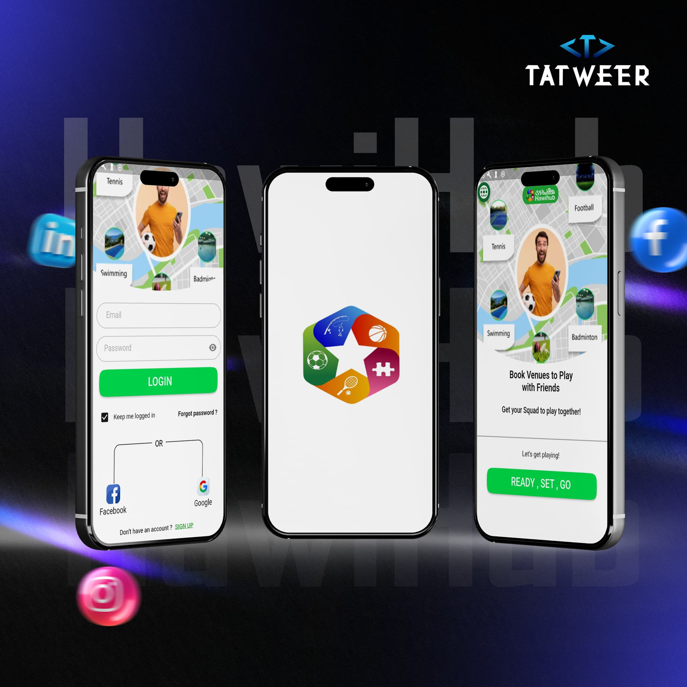
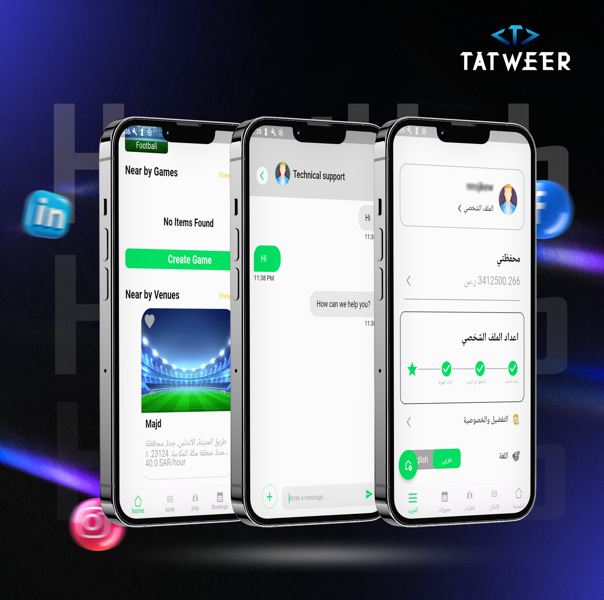
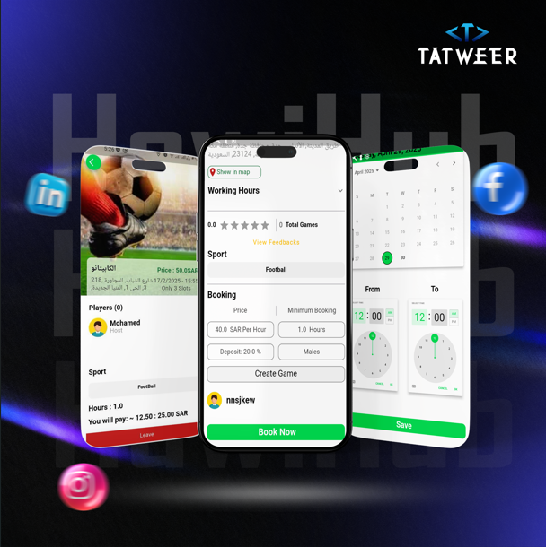
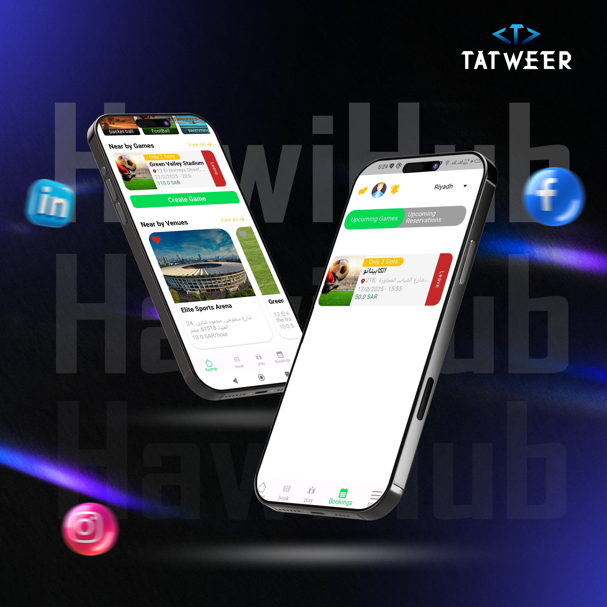
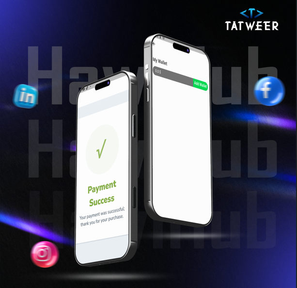

# 🏟️ HawiHub

**HawiHub** is a smart mobile application that connects players with playground owners to make booking fields easier, faster, and more organized. Whether you're looking to reserve a place to play or you own a playground and want to manage reservations, HawiHub is your go-to solution.

---

## 📸 Screenshots

|---------------|-------|------|
|  |  |  |

|---------------|----------------|--------|
|  |  |  |

---

## ✨ Features

- Sign in using email or Google.
- Separate dashboards for players and field owners.
- Add and manage playgrounds (with photos, prices, time slots).
- Players can search for fields based on location and availability.
- Request bookings and receive instant notifications.
- View booking status: pending, approved, or rejected.
- Bilingual support: Arabic and English.
- Push notifications for all booking events.

---

## 🧪 How It Works

### For Players:
1. Log into the app.
2. Search for available fields.
3. Send a booking request.
4. Get notified when it’s approved or rejected.

### For Field Owners:
1. Log into the app.
2. Add your playground (name, location, images, available hours).
3. Manage incoming booking requests.
4. Accept or reject bookings in real-time.

---

## 🛠️ Technologies Used

- **Flutter** for mobile development
- **Web Socket** for real time chat
- **Firebase Authentication** for secure login
- **Cloud Firestore** for real-time data storage
- **Google Maps API** for location services
- **Dio** for networking
- **Flutter Bloc** for state management
